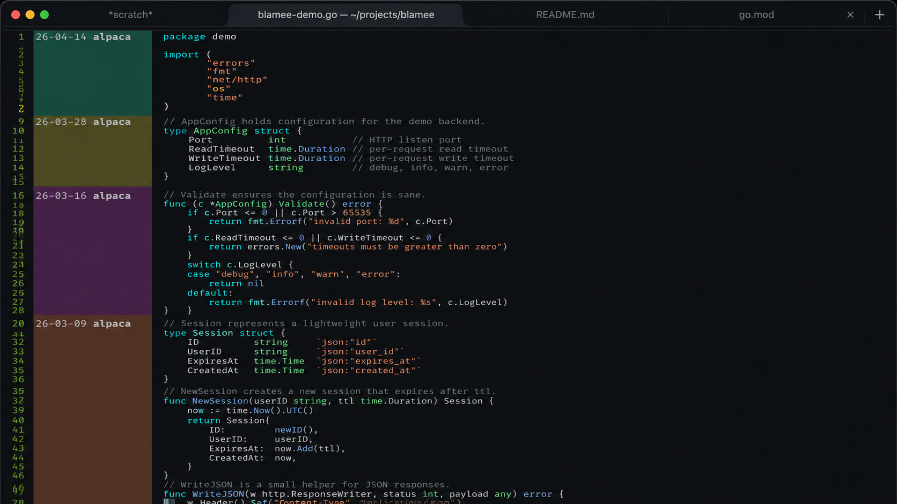

# blamee.el



Chunked `git blame` overlays for Emacs, rendered between the line numbers
and the source text. Each commit chunk is painted with its own subtle
background color, and a child-frame popup shows the full commit detail
when the cursor lands on a blamed line.

```
26-04-23 alice │ #!/usr/bin/env bash
               │ # previous banner
26-04-23 bob   │ set -euo pipefail
               │
26-04-23 alice │ cleanup() {
               │   rm -f "${tmp:-}"
               │ }
```

The blame prefix stays compact by default: **commit date + author**.
You can change the visible inline columns from `M-x customize-group RET
blamee`, and the inline area widens or shrinks to the longest visible
value in the current window instead of reserving a fixed width. Full
details (author, timestamp, 12-char hash, summary) appear in a popup or
echo area when you move point into the chunk.

## Features

- **Chunk grouping** — the inline prefix is drawn only on the first line
  of each same-commit run; continuation lines keep the source aligned.
- **Per-commit background color** — hue derived from the commit hash,
  so the colored stripe visualizes how far each chunk extends.
- **Popup details** — a frameless child frame on GUI Emacs (echo area
  fallback on TTY) shows author / date / hash / summary on point hover.
- **Mouse tooltips** — `help-echo` is attached to the inline prefix too,
  so hovering with the mouse works as well.
- **Auto-enable** — `global-blamee-mode` activates only for file-visiting
  buffers inside a git working tree.
- **Zero dependencies** beyond Emacs 27.1.

## Requirements

- Emacs 27.1 or newer (`color.el`, `make-frame` child frames).
- `git` executable on `PATH`.

## Installation

### straight.el

```elisp
(straight-use-package
 '(blamee :type git :host github :repo "fvi-att/blamee"))
(global-blamee-mode 1)
```

### use-package + straight

```elisp
(use-package blamee
  :straight (blamee :type git :host github :repo "fvi-att/blamee")
  :hook (after-init . global-blamee-mode)
  :bind (("C-c b b" . blamee-show-commit-at-point)
         ("C-c b y" . blamee-copy-commit-hash-at-point)
         ("C-c b r" . blamee-refresh)))
```

### Manual

Clone the repository somewhere and point `load-path` at it:

```elisp
(add-to-list 'load-path "/path/to/blamee")
(require 'blamee)
(global-blamee-mode 1)
```

### MELPA

Not yet available. A MELPA recipe is planned.

## Usage

| Command                              | Description                                       |
|--------------------------------------|---------------------------------------------------|
| `M-x blamee-mode`                    | Toggle in the current buffer.                     |
| `M-x global-blamee-mode`             | Toggle globally (auto-enables on git-tracked files). |
| `M-x blamee-refresh`                 | Recompute blame overlays (e.g. after an external commit). |
| `M-x blamee-show-commit-at-point`    | Force the popup to show for the chunk at point.   |
| `M-x blamee-copy-commit-hash-at-point` | Kill-ring the full 40-char commit hash.         |

Point movement to a blamed line opens the popup automatically after
`blamee-popup-delay` seconds of idle time. Moving off the blamed line,
switching buffers, or disabling `blamee-mode` hides it.

## Customization

All options live in the `blamee` customize group (`M-x customize-group
RET blamee`).

### Inline prefix

| Variable                     | Default       | Meaning                                         |
|------------------------------|---------------|-------------------------------------------------|
| `blamee-inline-columns`      | `(date author)` | Ordered inline columns to render.             |
| `blamee-comment-max-length`  | `10`          | Max inline summary width before truncation.     |
| `blamee-date-format`         | `"%y-%m-%d"`  | `format-time-string` spec for the inline date.  |
| `blamee-separator`           | `" │ "`       | Glyph between blame prefix and source.          |
| `blamee-uncommitted-label`   | `"Uncommitted"` | Label shown for uncommitted lines.            |
| `blamee-uncommitted-summary` | `"(not yet committed)"` | Summary text for uncommitted lines.   |
| `blamee-author-max-length`   | `5`           | Max inline author width before truncation.      |
| `blamee-hash-length`         | `6`           | Max inline hash width before truncation.        |

`blamee-inline-columns` accepts any ordered combination of `author`,
`date`, `summary`, and `hash`. The default stays intentionally small,
but you can expose more metadata inline when needed. The separator
position follows the longest visible value in the current window, so the
blame gutter grows and shrinks as you scroll.

### Chunk background color

| Variable                        | Default | Meaning                                    |
|---------------------------------|---------|--------------------------------------------|
| `blamee-background-saturation`  | `0.32`  | HSL saturation (0.0 – 1.0).                |
| `blamee-background-lightness`   | `0.22`  | HSL lightness. Use ≈0.85 for light themes. |

Colors are deterministic: the hue comes from the commit hash, so each
commit keeps the same tint across sessions and files.

### Popup

| Variable                              | Default             | Meaning                                          |
|---------------------------------------|---------------------|--------------------------------------------------|
| `blamee-popup-enabled`                | `t`                 | Set `nil` to disable the popup entirely.         |
| `blamee-popup-delay`                  | `0.5`               | Idle seconds before the popup appears.           |
| `blamee-popup-detail-date-format`     | `"%Y-%m-%d %H:%M"` | Date format inside the popup.                    |
| `blamee-popup-max-width`              | `70`                | Maximum inner width of the popup frame (columns). |

### Timing

| Variable             | Default | Meaning                                          |
|----------------------|---------|--------------------------------------------------|
| `blamee-idle-delay`  | `0.3`   | Seconds to wait after `save` / `revert` before recomputing. |

### Faces

All inline columns inherit from `blamee-face`, so tuning contrast is a
one-liner:

```elisp
(set-face-attribute 'blamee-face nil :foreground "gray60")
```

> **Note:** avoid scaling `blamee-face` via `:height` below `1.0`.
> Emacs draws the per-commit background rectangle at the reduced glyph
> height for non-space characters while runs of spaces still fill the
> full line height, so the colored chunk bar ends up unevenly sized
> across same-commit lines.

| Face                     | Purpose                                  |
|--------------------------|------------------------------------------|
| `blamee-face`            | Base face (inherits `shadow`).           |
| `blamee-author-face`     | Author column.                           |
| `blamee-date-face`       | Date column.                             |
| `blamee-comment-face`    | Summary column.                          |
| `blamee-hash-face`       | Hash column.                             |
| `blamee-separator-face`  | The `│` glyph.                           |

### Recipe: compact dark theme

```elisp
(setq blamee-comment-max-length 8
      blamee-date-format "%m-%d"
      blamee-inline-columns '(date summary)
      blamee-background-saturation 0.25
      blamee-background-lightness 0.2)
```

### Recipe: show author + hash inline

```elisp
(setq blamee-inline-columns '(author date hash summary)
      blamee-author-max-length 10
      blamee-hash-length 8)
```

### Recipe: light theme

```elisp
(setq blamee-background-lightness 0.88
      blamee-background-saturation 0.35)
```

### Recipe: disable the popup, keep inline + tooltip

```elisp
(setq blamee-popup-enabled nil)
```

The inline prefix still carries `help-echo`, so mouse tooltips keep
working even with the popup off.

## How it works

1. `git blame --porcelain` is run against the file on disk.
2. The output is parsed into `(LINENO . COMMIT-PLIST)` entries.
3. For each line, a zero-width overlay is placed at `line-beginning-position`
   with a `before-string` that contains the blame prefix (or a same-width
   spacer for continuation lines).
4. `display-line-numbers-mode` renders line numbers in its dedicated
   pre-text area, so the blame prefix appears **between** the numbers
   and the source text.
5. A global `post-command-hook` watches for point entering a blamed
   line and schedules the popup after `blamee-popup-delay` idle seconds.

## Limitations / notes

- Workaround: `blamee-mode` currently makes the buffer read-only while
  enabled to avoid editing conflicts with the inline overlay layout.
  Disable `blamee-mode` before editing.
- Blame is computed against the **on-disk** file; unsaved changes are
  ignored until the next save.
- Files not yet committed are labeled as `Uncommitted` with no background
  color.
- The popup uses Emacs child frames (requires `display-graphic-p`).
  On a terminal it falls back to the echo area.
- Very large files will take as long as `git blame` takes; no
  asynchronous path yet.

## Development

```sh
# Byte-compile (also runs as a lint)
emacs -Q --batch -L . -f batch-byte-compile blamee.el
```

No tests yet. Contributions welcome.

## License

GPL-3.0-or-later. See [LICENSE](LICENSE).
